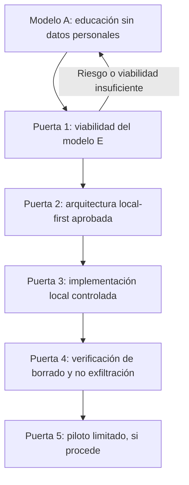

# Consona — Ruta crítica mantenida del modelo E

**Propósito:** identificar las puertas acumulativas que determinan si Consona puede avanzar desde un producto educativo hacia un piloto personalizado seguro.
**Última revisión documental:** 2 de octubre de 2026.
**Fuente de estado vivo:** [Linear — Consona App](https://linear.app/juan-vidaechea/team/JUA/all).
**Evidencia versionada:** [GitHub — `main`](https://github.com/juanvidavida/Consona-APP/tree/main).

> Esta ruta no autoriza funcionalidades. Es un documento de navegación: los límites vinculantes están en ADR-001, ADR-002 y la línea base. La ausencia de una puerta satisfecha conserva el modelo educativo sin datos de ciclo de otra persona.

## 1. Decisión y límite de alcance

La dirección de producto es estudiar el **modelo E**: datos de ciclo y derivados exclusivamente locales en el dispositivo receptor, con una excepción remota mínima para coordinación de consentimiento y revocación. El modelo A —educación sin datos de ciclo de otra persona— sigue siendo la contingencia obligatoria si la viabilidad, seguridad o revisión jurídica no resultan satisfactorias.

La excepción remota **nunca** permite almacenar, sincronizar, inferir o registrar fechas, fases, variables, síntomas, anticoncepción, nombres, notas, contenido derivado, analítica, telemetría o registros remotos de errores.

## 2. Lectura del corte actual

| Hito / evidencia | Corte documental | Consecuencia para la ruta |
|---|---|---|
| JUA-10 / P1 taxonomía local | Cerrado y fusionado mediante PR #2. | El vocabulario local está acotado; no habilita captura, persistencia ni datos reales. |
| JUA-20 / CON-007 | Cerrado y fusionado mediante [PR #5](https://github.com/juanvidavida/Consona-APP/pull/5). | Existe protocolo de autorización, retirada, borrado y offline como diseño y matriz de pruebas. Su implementación funcional sigue pendiente. |
| JUA-21 / CON-008 | Cerrado documentalmente y fusionado mediante [PR #6](https://github.com/juanvidavida/Consona-APP/pull/6). | Existe contrato técnico de minimización: referencias opacas, rechazo de datos sensibles y límites de API. No existe servicio desplegado ni emparejamiento habilitado. |
| JUA-22 / CON-010 | Backlog en el corte consultado. | La revisión jurídica profesional sigue siendo puerta obligatoria antes de arquitectura definitiva o piloto. |
| JUA-13 | Backlog en el corte consultado. | Puerta transversal C1–C10 de ADR-001 y P6 de ADR-002; no se cierra por terminar documentos individuales. |
| JUA-17 / P8 y JUA-18 / P5 | Backlog en el corte consultado. | Falta evidencia sobre flujos reales: ausencia de exfiltración, y borrado/revocación locales tras recarga, reinicio y conectividad interrumpida. |

**Grafo normalizado el 2 de octubre de 2026:** se retiró el bloqueo formal `JUA-21 → JUA-17` y el bloqueo formal `JUA-20 → JUA-18`, porque CON-008 y CON-007 ya están `Done`. Ambas incidencias continúan en `Backlog` y sus dependencias funcionales siguen descritas en Linear: JUA-13, arquitectura local-first, CON-015, futuros flujos locales y la evidencia técnica aplicable. El retiro de un enlace documental satisfecho no habilita funcionalidad ni piloto.

## 3. Puertas críticas y criterio de salida

### Puerta 1 — Viabilidad del modelo E

**Objetivo:** decidir si el consentimiento entre dispositivos, la retirada y la excepción remota pueden ser aceptables sin crear un backend de salud o un mecanismo de control coercitivo.

| Entregable acumulativo | Evidencia ya disponible | Falta para salir |
|---|---|---|
| Esquema y minimización remota — C1/C2/C6 | [CON-008](../security/CON-008_REQUERIMIENTOS_TECNICOS_Y_API.md). | Esquema/fixtures/validador local, política cuantificada de retención y revisión de seguridad/jurídica. |
| Consentimiento, retirada, borrado y offline — C3/C4/C5 | [CON-007](../security/CON-007_AUTORIZACION_REVOCACION_Y_OFFLINE.md) y su matriz. | Implementación funcional y pruebas con fixtures sintéticos sobre la arquitectura real. |
| Revisión jurídica — C8 | Alcance preparado para revisión. | Dictamen profesional independiente sobre roles, base jurídica, retención, proveedor, región y transparencia. |
| EIPD, violencia tecnológica y amenazas — C7/C8/P6 | Riesgos explícitos en ADR-001, CON-007 y CON-008. | EIPD, evaluación de violencia tecnológica, modelo de amenazas, mitigaciones y criterios de veto. |
| Contingencia — C10 | Principio recogido en ADR-001. | Procedimiento de detención, borrado, comunicación y evidencia mínima no sensible ante fallo. |

**Salida:** una decisión explícita y revisada de continuar con modelo E, reducir su alcance o conservar el modelo A. No basta con tener documentación integrada en `main`.

### Puerta 2 — Arquitectura local-first aprobada

**Objetivo:** traducir las decisiones de Puerta 1 a una arquitectura de cliente, almacenamiento, claves, caché, PWA y distribución comprobable.

Requiere:

- decisión de almacenamiento local, claves y borrado verificable;
- CSP restrictiva, dependencias empaquetadas y origen único de coordinación si se aprueba;
- política compatible de logs, errores, retención, región y subprocesadores;
- separación entre cliente estático, datos locales y servicio mínimo de propósito único;
- estrategia de Service Worker que no almacene ni retransmita datos sensibles ni bloquee el borrado.

**Salida:** una arquitectura revisada que no presente rutas incidentales de exfiltración, caché incompatible o persistencia remota de datos de ciclo.

### Puerta 3 — Implementación local controlada

**Objetivo:** construir solo después de Puertas 1 y 2 los flujos locales que los ADR permiten estudiar.

| Área | Resultado verificable requerido |
|---|---|
| Consentimiento funcional | Decisión directa, granular, revisable y retirable. La persona usuaria no puede crear, modificar ni reactivar el consentimiento de la persona afectada. |
| Control de consentimiento | Dispositivo de control independiente para revisar y retirar el permiso; no recibe fecha, fase, variables ni derivados del receptor. |
| Entrada local de datos | El receptor no trata datos fuera del permiso activo. La app no afirma que una fecha se haya verificado criptográficamente en un dispositivo compartido. |
| Borrado e invalidación | Bloqueo antes de borrar, eliminación de origen, derivados, caché, claves y UI, sin reutilización posterior. |
| Motor de estimación | UTC, rango individual, margen, caducidad, anticoncepción y mensajes no anticonceptivos. |

**Salida:** funcionalidad limitada a datos sintéticos en pruebas hasta completar la evidencia de Puerta 4.

### Puerta 4 — Verificación independiente

**Objetivo:** probar que la arquitectura implementada respeta lo diseñado.

- **JUA-17 / P8:** inventario de dependencias, CSP, recursos, endpoints, caché, logs y trazas de red de los flujos reales; demostrar que datos de ciclo y derivados no salen del dispositivo.
- **JUA-18 / P5:** pruebas repetibles de retirada, bloqueo, borrado, reinicio, recarga, caché, claves, colas y recepción offline.
- Revisión de resultados por producto, privacidad/seguridad e ingeniería; incorporación de los hallazgos jurídicos y del modelo de amenazas.

**Salida:** evidencia revisada con resultados y límites explícitos. Un fallo de exfiltración, borrado o control suspende el avance al piloto.

### Puerta 5 — Evaluación de piloto limitado

Un piloto personalizado solo puede considerarse si todas las condiciones de ADR-001 C1–C10 y ADR-002 P1–P8 aplicables están documentadas, implementadas, probadas y revisadas. El piloto es exclusivamente para personas adultas y no convierte la aplicación en un método anticonceptivo ni en una herramienta diagnóstica.

## 4. Trabajo paralelo permitido ahora

| Carril | Puede avanzar sin datos reales | Condición |
|---|---|---|
| Educación y contenido | Sí. | Modelo A: sin introducir, conservar, inferir ni transmitir datos de ciclo de otra persona. |
| Accesibilidad, i18n y calidad PWA | Sí. | Sin recursos de terceros, analítica o caché de contenido sensible. |
| CON-010 / preparación de revisión jurídica | Sí. | El dictamen final debe evaluar los documentos consolidados y la futura infraestructura elegida. |
| CON-013 / CON-015 | Sí. | Deben poder vetar o reducir funcionalidad; no se usan para justificar una implementación adelantada. |
| Esquemas, fixtures y validadores locales | Sí. | Solo datos sintéticos, sin endpoint externo, sin persistencia de información real. |

## 5. Reglas de mantenimiento

1. Actualizar este documento cuando cambie una **puerta**, una **decisión de alcance** o una **dependencia de alto nivel**.
2. No modificar este documento por cambios de estado menores: Linear sigue siendo el registro operativo.
3. Los documentos de diseño se ubican en `docs/security/`; sus revisiones y pruebas deben enlazarse desde aquí, no copiarse.
4. Los cortes previos están archivados en [`snapshots/`](./snapshots/) y no deben utilizarse como instrucciones actuales.
5. Ningún cambio documental habilita por sí mismo datos reales, despliegue, cuentas, sincronización, telemetría ni piloto.

## Referencias

- [Índice de gobernanza](./README.md)
- [CON-007 — autorización, retirada, borrado y offline](../security/CON-007_AUTORIZACION_REVOCACION_Y_OFFLINE.md)
- [CON-008 — requisitos técnicos y API](../security/CON-008_REQUERIMIENTOS_TECNICOS_Y_API.md)
- [`CONSONA_LINEA_BASE_Y_BACKLOG.md`](../../info/Consona_entrega_completa/archivos_compartidos/CONSONA_LINEA_BASE_Y_BACKLOG.md)
- [`CONSONA_ADR-001_CONTROL_LOCAL_Y_CONSENTIMIENTO.md`](../../info/Consona_entrega_completa/archivos_compartidos/CONSONA_ADR-001_CONTROL_LOCAL_Y_CONSENTIMIENTO.md)
- [`CONSONA_ADR-002_APRENDIZAJE_LOCAL_Y_VARIABILIDAD_PREMENSTRUAL.md`](../../info/Consona_entrega_completa/archivos_compartidos/CONSONA_ADR-002_APRENDIZAJE_LOCAL_Y_VARIABILIDAD_PREMENSTRUAL.md)
