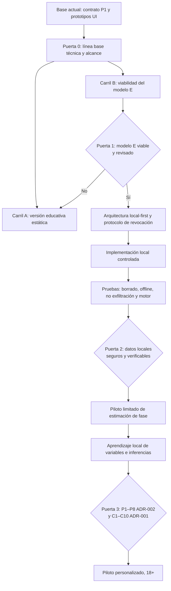

> **Archivo histórico — sustituido como documento operativo.**
>
> Análisis del 1 de octubre de 2026. Conserva el razonamiento original y las decisiones de ese corte; la fuente operativa mantenida es [`../ruta-critica-modelo-e.md`](../ruta-critica-modelo-e.md). Los estados vivos y las dependencias operativas se consultan en Linear.

# Consona — Ruta crítica del proyecto

**Fecha de análisis:** 1 de octubre de 2026
**Objetivo de la ruta:** llegar a un **piloto personalizado seguro** sin infringir ADR-001 ni ADR-002.
**Dirección de producto confirmada el 1 de octubre de 2026:** el MVP necesita funcionar en pareja con información de la persona afectada; por ello la ruta de trabajo elegida es el **modelo E**.
**Horizonte alternativo de seguridad:** el modelo A se conserva solo como contingencia de ADR-001 si el modelo E no supera sus controles; no se considera el MVP objetivo.

> **Principio rector.** Consona no llega al piloto por completar pantallas. Llega cuando puede demostrar control local, consentimiento directo, revocación y borrado verificables, seguridad frente a coerción, ausencia de salida remota de datos sensibles, estimación responsable y revisión profesional. Si alguna condición no es viable, se conserva el modelo A —educación sin datos de la persona afectada— en lugar de rebajar el control.

> **Cuello de botella actual.** JUA-13 es la puerta inicial del modelo E. No debe cerrarse como una tarea única de documentación: su salida efectiva exige que CON-008, CON-007, CON-010, CON-013 y CON-015 produzcan decisiones, revisiones y evidencias compatibles entre sí. Solo entonces puede comenzar CON-030 —la arquitectura local-first definitiva— y, después, el consentimiento funcional, el borrado verificable y la estimación local.

---

## 1. Lectura ejecutiva

La ruta crítica no es linealmente «diseño → desarrollo → lanzamiento». Tiene dos carriles:

1. **Carril educativo (modelo A):** contenido y experiencia sin introducir, conservar o inferir datos de ciclo personales. Puede avanzar ya y puede alcanzar una publicación estática antes que el piloto personalizado.
2. **Carril personalizado (modelo E):** consentimiento y revocación mínimos entre dispositivos, con todos los datos de ciclo y variables exclusivamente locales. Es la **ruta crítica más restrictiva** y determina la fecha posible de cualquier piloto con estimación personal, registros o aprendizaje.

La conclusión práctica es que **no conviene esperar al piloto personalizado para entregar valor educativo**, pero tampoco conviene convertir una UI existente en seguimiento real sin superar las puertas de seguridad.

---

## 2. Punto de partida verificado

| Elemento | Estado verificado | Lectura para la ruta |
|---|---|---|
| [JUA-10 / P1 ADR-002](https://linear.app/juan-vidaechea/issue/JUA-10/p1-adr-002-aprobar-contrato-de-taxonomia-local-cerrada-y-verificar) | **Done**; contrato taxonómico fusionado en [PR #2](https://github.com/juanvidavida/Consona-APP/pull/2). | El vocabulario v1 ya limita qué podría admitirse: tres categorías físicas, solo `self_report`, tres intensidades y campos prohibidos. No habilita captura ni datos reales. |
| [JUA-6 / P2 ADR-002](https://linear.app/juan-vidaechea/issue/JUA-6/p2-adr-002-implementar-y-probar-consentimiento-granular-por-fuente-y) | **Done**; [PR #4](https://github.com/juanvidavida/Consona-APP/pull/4) fusionado. | Es un **prototipo no persistente** de interfaz de control de datos. La propia incidencia aclara que no implementa consentimiento directo, emparejamiento, revocación real ni persistencia; por tanto, **no satisface P2 funcional**. |
| Repositorio `main` | [Público](https://github.com/juanvidavida/Consona-APP), React 19 + Vite 8 + `vite-plugin-pwa`; `package-lock.json` presente. | Hay una base de desarrollo actual y reproducible; el resumen técnico histórico debe actualizarse, pues decía que no había repositorio Consona activo ni lockfile. |
| Configuración PWA | `autoUpdate` y caché gestionada por `vite-plugin-pwa`. | La instalación/offline es un riesgo de seguridad y borrado, no solo una mejora de UX. Debe entrar en las pruebas de caché, revocación y borrado. |
| [JUA-13](https://linear.app/juan-vidaechea/issue/JUA-13/adr-001adr-002-control-local-eipd-y-seguridad-frente-a-observaciones) | Backlog, urgente. | Es el nodo transversal: C1–C10 de ADR-001 y P6 de ADR-002. Hoy bloquea cualquier uso funcional de datos reales. |
| [JUA-17](https://linear.app/juan-vidaechea/issue/JUA-17/adr-001adr-002-p8-verificar-ausencia-de-salida-remota-de-datos-locales) y [JUA-18](https://linear.app/juan-vidaechea/issue/JUA-18/adr-002-p5-verificar-borrado-y-revocacion-local-de-datos-y-derivados) | Backlog, urgentes. | No se puede demostrar aún ni la ausencia de exfiltración sobre flujos reales ni el borrado/revocación reales. Ambos bloquean registros, aprendizaje y piloto. |
| [JUA-14](https://linear.app/juan-vidaechea/issue/JUA-14/adr-002-p3-disenar-y-verificar-la-explicacion-de-inferencias-locales) y [JUA-15](https://linear.app/juan-vidaechea/issue/JUA-15/adr-002-p4-especificar-y-validar-umbrales-contradicciones-y-falsos) | Backlog, urgentes. | Bloquean específicamente el aprendizaje de variables y las inferencias personalizadas; no necesariamente una primera versión educativa sin datos. |
| [JUA-19](https://linear.app/juan-vidaechea/issue/JUA-19/con-027-redactar-la-pantalla-educativa-sobre-variabilidad-premenstrual) → [JUA-16](https://linear.app/juan-vidaechea/issue/JUA-16/adr-002-p7-revisar-clinicamente-la-pantalla-spmtdpm-y-sus-derivaciones) | Backlog, alta. | Es una cadena editorial y clínica independiente: redactar primero, revisar profesionalmente después. Bloquea el piloto personalizado, pero puede avanzar sin datos. |

**Aclaración decisiva:** el hecho de que JUA-6 esté cerrado no debe usarse como señal de que el consentimiento granular está implementado. La incidencia lo limita expresamente a una interfaz no persistente; se necesita una tarea sucesora funcional y verificable.

---

## 3. Puerta 0 — Rebaselinar antes de programar datos

**Propósito:** que la documentación, el backlog y el repositorio describan el mismo producto antes de empezar el carril personalizado.

| Trabajo | Evidencia de salida | Responsable principal |
|---|---|---|
| Actualizar el resumen técnico frente al estado de `main`. | Inventario verificado de stack React/Vite/PWA, `package-lock`, recursos locales, rutas de red y estrategia de build. | Ingeniería / arquitectura |
| Delimitar dos entregables separados: **versión educativa** y **piloto personalizado**. | Documento de alcance que impida que una demo de “Hoy” o control de datos se presente como seguimiento real. | Producto + privacidad |
| Desagregar las tareas críticas que hoy están agrupadas en JUA-13. | Incidencias trazables para CON-007, CON-008, CON-010, CON-013, CON-015, CON-030 y la implementación funcional de P2. | Producto / project management |
| Fijar la definición de “datos sintéticos”, “datos reales” y “entorno de prueba”. | Política que prohíba datos de ciclo personales en desarrollo y pruebas hasta la puerta aplicable. | Privacidad + ingeniería |

### Criterio de salida de Puerta 0

Existe una única línea base técnica y de producto, con dos rutas explícitas. No se empieza persistencia, emparejamiento ni ingreso de fechas reales bajo una etiqueta ambigua de “prototipo”.

---

## 4. Carril A — Versión educativa estática sin datos personales

Este carril no sustituye la ruta al piloto personalizado, pero reduce el riesgo de paralizar el producto. Debe funcionar bajo el **modelo A**: educación, conversación y accesibilidad sin conocer el ciclo de una persona concreta.

### Cadena del carril educativo

1. **Completar “Cómo funciona” — [JUA-7](https://linear.app/juan-vidaechea/issue/JUA-7/completar-el-recorrido-educativo-como-funciona).**
   - Explica qué se podría estimar en el futuro, rango, incertidumbre, caducidad, anticoncepción, consentimiento y límites.
   - No solicita fechas, síntomas ni variables.

2. **Contenido seguro y revisión clínica.**
   - Redactar la pantalla SPM/TDPM versionada: [JUA-19](https://linear.app/juan-vidaechea/issue/JUA-19/con-027-redactar-la-pantalla-educativa-sobre-variabilidad-premenstrual).
   - Someter la versión exacta a revisión profesional: [JUA-16](https://linear.app/juan-vidaechea/issue/JUA-16/adr-002-p7-revisar-clinicamente-la-pantalla-spmtdpm-y-sus-derivaciones).
   - Completar CON-020 a CON-026: auditoría de contenido, consentimiento sexual como módulo independiente de fases, sesgo de atribución, anticoncepción, orientación sanitaria, evidencia y traducciones ES/CA/EN.

3. **Calidad del cliente educativo.**
   - Accesibilidad, móvil, teclado, lector de pantalla y experiencia PWA: [JUA-8](https://linear.app/juan-vidaechea/issue/JUA-8/validar-pwa-accesibilidad-y-respuesta-movil).
   - CSP `default-src 'self'`, recursos empaquetados, sin CDN, analítica, telemetría ni error reporting remoto.
   - Revisar que la PWA no guarde contenido sensible y que la caché no introduzca datos personales.

4. **Publicación estática solo si se supera una revisión de distribución.**
   - Hosting y CDN compatibles con la restricción de no enviar datos personales de ciclo.
   - Política de privacidad coherente con una app educativa; no prometer funcionalidades personalizadas inexistentes.

### Puerta A — Salida educativa

La versión puede publicarse como educativa si no trata datos de ciclo personales, no tiene seguimiento oculto y supera contenido, accesibilidad, dependencias locales y revisión de red. **No se denomina piloto personalizado ni usa fechas reales.**

---

## 5. Carril B — Ruta crítica hacia un piloto con estimación personalizada

Esta es la cadena que fija el calendario real del piloto. No debe comprimirse por presión de producto: sus puertas son acumulativas.

### Tramo B1 — Viabilidad del modelo E y controles de diseño

**Objetivo:** decidir si el modelo E es técnicamente, jurídicamente y éticamente viable sin convertir Consona en un backend de salud.

| Bloque crítico | Trabajo asociado | Evidencia mínima |
|---|---|---|
| **Contrato mínimo del servicio** | CON-008; ADR-001 C1, C2 y C6. | Esquema de los únicos metadatos permitidos: identificador pseudónimo efímero/rotable, vínculo técnico, estado de consentimiento y solicitud genérica de revocación. Retención, rotación, borrado y prohibición de logs verificables. No hay campos extensibles de ciclo. |
| **Protocolo de consentimiento, retirada y offline** | CON-007; ADR-001 C3, C4 y C5. | Flujos de consentimiento directo, rechazo, revocación, bloqueo, borrado local y estados del receptor sin red, apagado, desinstalado o retrasado. Comunicación honesta: no se promete borrado remoto instantáneo. |
| **Revisión jurídica y seguridad contra coerción** | CON-010, CON-013, CON-015; JUA-13; ADR-001 C7–C8 y ADR-002 P6. | Dictamen jurídico; EIPD; modelo de amenazas; evaluación de violencia tecnológica; mitigaciones, riesgo residual y criterios de veto. Debe cubrir presión, suplantación, dispositivo compartido o comprometido, reenvío, acceso persistente, caché y manipulación de fuente. |
| **Plan de contingencia** | ADR-001 C10. | Proceso probado de detención, borrado, comunicación y preservación de evidencia no sensible ante un fallo de control o exfiltración. |

**Dependencia real:** estos cuatro bloques se diseñan en paralelo e iteran entre sí. No obstante, **todos deben converger antes de definir la arquitectura definitiva**. No basta con un diagrama técnico si EIPD, revisión jurídica o amenazas obligan a cambiar el protocolo.

### Puerta B1 — Decisión de viabilidad

Un comité de producto, privacidad/seguridad y revisión jurídica decide una de estas opciones:

- **Continuar con modelo E:** las restricciones pueden implementarse y verificarse.
- **Reducir alcance:** por ejemplo, posponer indefinidamente observaciones de pareja —ya excluidas de v1— y conservar exclusivamente `self_report` futuro.
- **Volver a modelo A para la primera publicación:** si el consentimiento entre dispositivos, la revocación offline o el riesgo de coerción no alcanzan un nivel aceptable.

La decisión debe ser explícita, trazable y reversible. No se asume que el modelo E es viable solo porque el ADR lo aceptó con condiciones.

### Tramo B2 — Arquitectura local-first y base de ingeniería

**Entrada:** Puerta B1 aprobada.
**Objetivo:** transformar las decisiones de seguridad en restricciones comprobables de código e infraestructura.

1. **CON-030 — arquitectura local-first definitiva.**
   - Cliente estático; sin backend de ciclos, cuentas de ciclo, perfiles múltiples, sincronización ni backups.
   - Elección documentada de almacenamiento local y protección de claves/caché.
   - Servicio E separado y de propósito único, si la Puerta B1 lo conserva.
   - Región europea, configuración de logs, subprocesadores y DPA aplicable revisados antes de producción.

2. **Base de ingeniería reproducible y auditable.**
   - Dependencias fijadas y revisión de dependencias.
   - CSP restrictiva, inventario de endpoints y recursos empaquetados localmente.
   - Aislar la PWA: estrategia de caché y actualización que permita borrado/invalidación completos.
   - CI de validación, pruebas de red y revisión de secretos/logs sin registrar datos sensibles.

3. **CON-031 — migrar solo componentes seguros.**
   - Navegación, estilos, i18n y contenido educativo.
   - No migrar código histórico de `localStorage`, consentimiento declarativo unilateral o formularios de ciclo como si fuera una base autorizada.

### Puerta B2 — Arquitectura implementable

Se demuestra que la arquitectura no contiene una ruta incidental de salida de datos ni un mecanismo de caché que impida retirar/borrar. Hasta esta puerta, cualquier demostración usa fixtures sintéticos y no persistentes.

### Tramo B3 — Mínimo funcional para estimación local responsable

**Objetivo:** habilitar una estimación local solo si el flujo de datos y su control ya son reales y probados.

| Componente | Trabajo / condición | Resultado exigido |
|---|---|---|
| Consentimiento funcional | Tarea sucesora de JUA-6 para implementar P2 real, acorde a C3/C4 y la taxonomía P1. | Consentimiento directo, granular, revisable y retirable. Una categoría no autorizada queda bloqueada técnicamente. La v1 no incluye observación de pareja. |
| Persistencia local y eliminación | Base para CON-037 y [JUA-18 / P5](https://linear.app/juan-vidaechea/issue/JUA-18/adr-002-p5-verificar-borrado-y-revocacion-local-de-datos-y-derivados). | Borrar registro, categoría, fuente o historial invalida datos, cálculos, caché, claves y derivados tras recarga, reinicio y recomputación. |
| Motor de fase | CON-032; ADR-001 C9. | Motor auditado integrado con UTC, datos pasados confirmados, anticoncepción, rango individual, margen, caducidad y mensajes no anticonceptivos. |
| Onboarding y panel | CON-005, CON-033 y CON-034; especificación “Hoy”. | Explicación antes del primer uso, “Cómo funciona” permanente y panel limpio: fase, día, ventana, actualización y cuatro tarjetas de orientación; estados inválidos no muestran fase vigente. |
| No exfiltración | [JUA-17 / P8](https://linear.app/juan-vidaechea/issue/JUA-17/adr-001adr-002-p8-verificar-ausencia-de-salida-remota-de-datos-locales); ADR-001 C6. | Trazas de red y revisión de dependencias, logs, errores y caché sobre flujos reales. El servicio E, si existe, demuestra que acepta exclusivamente sus metadatos autorizados. |

### Puerta B3 — Piloto limitado de fase

Solo se abre si C1–C10 de ADR-001 aplicables están demostradas y revisadas, incluido borrado, revocación offline, seguridad, ausencia de salida remota, motor responsable y contingencia. El piloto es 18+, no anticonceptivo, con alcance documentado y sin observaciones de pareja.

---

## 6. Extensión posterior: aprendizaje local de variables e inferencias

Esta rama **no es necesaria para una versión educativa ni para una estimación local de fase limitada**. Solo debe abrirse tras la Puerta B3 y con una decisión nueva de producto.

| Orden | Dependencia | Trabajo crítico | Puerta de salida |
|---:|---|---|---|
| 1 | P1 ya completado | Mantener contrato cerrado y la v1 de `self_report`; no añadir categorías o fuentes sin revisión versionada. | Semántica estable. |
| 2 | P2 funcional | Implementar permiso por **categoría × fuente × permiso**, revisión y retirada efectiva. | No entra ni se reutiliza un dato sin autorización vigente. |
| 3 | [JUA-15 / P4](https://linear.app/juan-vidaechea/issue/JUA-15/adr-002-p4-especificar-y-validar-umbrales-contradicciones-y-falsos) | Definir tres ciclos confirmados, cobertura, antigüedad, retención, contradicción y falsos positivos. | Estado predeterminado: “sin patrón identificado”. |
| 4 | [JUA-14 / P3](https://linear.app/juan-vidaechea/issue/JUA-14/adr-002-p3-disenar-y-verificar-la-explicacion-de-inferencias-locales) | Vista separada, fuente, muestra, incertidumbre y motivo; nunca en la home. | Asociación posible y no diagnóstica explicable. |
| 5 | P5, P6, P8 | Verificar borrado, coerción, separación de fuentes, no exfiltración y revocación. | Ningún derivado permanece tras retirada. |
| 6 | CON-037, CON-038 y CON-039 | Registros locales consentidos, motor explicable y validación de sesgo/daño/falsos positivos. | Solo entonces podría estudiarse un piloto que incluya aprendizaje local. |

La observación de pareja permanece **fuera de la v1**. No debe incluirse por “completitud”: la evaluación P6 puede vetarla incluso si la infraestructura funciona.

---

## 7. Contenido clínico, accesibilidad y localización: dependencias de piloto, no adornos

| Cadena | Relación con la ruta crítica |
|---|---|
| JUA-19 → JUA-16 | La pantalla SPM/TDPM y mensajes de derivación deben existir, estar versionados y recibir revisión profesional con identidad, credenciales, comentarios y aprobación. Bloquea el piloto personalizado según ADR-002 P7. |
| CON-025 + JUA-8 | Español internacional, catalán e inglés con los mismos límites, junto con teclado, lector de pantalla, contraste, móvil y PWA. No basta con traducir literalmente textos de seguridad. |
| CON-011 y CON-012 | Materiales de conversación para parejas, política de privacidad, aviso a la persona afectada y procedimiento de borrado. Son necesarios antes de cualquier prueba con personas, pues explican control local, revocación y límites offline. |
| CON-020 a CON-026 | Auditoría editorial, anticoncepción, sesgo de atribución, orientación sanitaria y trazabilidad de evidencia. Protegen contra lenguaje determinista, diagnóstico y falsas certezas. |

---

## 8. Lo que puede hacerse en paralelo y lo que no

| Puede avanzar en paralelo | No puede adelantarse | Razón |
|---|---|---|
| JUA-7, JUA-19 y la preparación de JUA-16. | Revisión clínica de JUA-16 antes de que exista la versión final de JUA-19. | La persona revisora necesita un artefacto exacto y versionado. |
| Arquitectura preliminar, EIPD de alcance y modelo de amenazas. | Arquitectura definitiva CON-030 antes de cerrar C1–C8 y la viabilidad de modelo E. | Las obligaciones jurídica, offline y de coerción pueden cambiar el diseño técnico. |
| i18n, accesibilidad, CSP, build reproducible y componentes educativos. | Activar entrada/persistencia de datos de ciclo bajo la apariencia de una demo. | El prototipo no puede sustituir consentimiento, revocación y borrado reales. |
| Especificación de umbrales P4 en datos sintéticos. | Mostrar inferencias o patrones personales antes de P2, P3, P5, P6 y P8. | La ausencia de evidencia debe producir “sin patrón identificado”. |
| Preparar pruebas de red y de borrado. | Cerrar JUA-17 o JUA-18 sin flujos reales implementados. | La evidencia de contrato no demuestra comportamiento de la aplicación. |

---

## 9. Riesgos que realmente gobiernan el calendario

| Riesgo | Señal temprana | Decisión de mitigación / salida |
|---|---|---|
| El modelo E no permite revocación suficientemente segura en offline. | No se encuentra una política honesta que limite acceso o borre de forma verificable al reconectar. | No prometer borrado inmediato; reducir alcance o mantener modelo A. |
| EIPD o evaluación de violencia tecnológica detecta riesgo residual inaceptable. | Coerción, dispositivo compartido, acceso persistente o observación no pueden mitigarse. | Vetar observación de pareja o el modelo E; no compensar con copy o una casilla. |
| La PWA/caché retiene datos o derivados tras revocación. | Persisten tras reinicio, recarga o actualización de Service Worker. | Replantear caché, claves y ciclo de actualización antes de habilitar datos. |
| Una dependencia, recurso remoto o logger abre una salida accidental. | Trazas o inventario muestran CDN, SDK, endpoint de errores o analytics. | Eliminarlo o bloquearlo con CSP/controles de build; repetir JUA-17. |
| Se interpreta la demo visual como un flujo autorizado. | La UI muestra fecha, fase o permiso sin control real detrás. | Etiquetar fixtures; no usar datos personales; separar demos de flujos operativos. |
| Falta revisión jurídica o clínica independiente. | No hay credenciales, alcance y aprobación trazables. | Mantener contenido/piloto bloqueado; no sustituirla por documentación interna. |

---

## 10. Próximos tres movimientos recomendados

1. **Abrir el bloque de viabilidad de modelo E bajo JUA-13**, desglosándolo como mínimo en: contrato del servicio mínimo (CON-008), protocolo de consentimiento/revocación/offline (CON-007), revisión jurídica (CON-010), EIPD/violencia tecnológica (CON-013) y modelo de amenazas/pruebas (CON-015).
2. **Corregir la trazabilidad de JUA-6:** mantenerlo como entrega de UI no persistente y crear una incidencia sucesora para P2 funcional. No reabrirlo ni marcar P2 implementado sin consentimiento directo, persistencia controlada, retirada y pruebas reales.
3. **Iniciar en paralelo el carril educativo:** JUA-7 y JUA-19, dejando preparada la revisión clínica JUA-16 y evitando introducir datos personales en esa fase.

No se recomienda iniciar CON-037/CON-038 ni abrir captura de datos reales antes de que las puertas B1 y B2 estén cerradas explícitamente.

---

## 11. Fuentes empleadas y alcance de esta lectura

| Fuente | Uso |
|---|---|
| `CONSONA_LINEA_BASE_Y_BACKLOG.md` | Dependencias P0–P4, condiciones de desarrollo y piloto, y modelo A/modelo E. |
| `CONSONA_ADR-001_CONTROL_LOCAL_Y_CONSENTIMIENTO.md` | C1–C10, límites de conectividad, revocación, servicio mínimo y contingencia. |
| `CONSONA_ADR-002_APRENDIZAJE_LOCAL_Y_VARIABILIDAD_PREMENSTRUAL.md` | P1–P8, consentimiento granular, aprendizaje local, límites clínicos e intimidad. |
| `CONSONA_DEFINICION_DE_APP.md` y `CONSONA_ESPECIFICACION_PANEL_PRINCIPAL.md` | Alcance de producto, “Hoy”, onboarding, estados seguros y criterios antes de piloto. |
| Linear, consultado el 1 de octubre de 2026 | Estado y alcance de JUA-6, JUA-10, JUA-13 a JUA-19. |
| GitHub, consultado el 1 de octubre de 2026 | PR #2 y #4 fusionados; `main` público con React/Vite/PWA, `package-lock.json` y contrato taxonómico. |

### Límites de esta ruta

- No incluye una estimación de calendario: faltan duración, disponibilidad y contratación de revisiones jurídica y clínica independientes.
- No presupone que el modelo E acabará siendo viable. La vuelta al modelo A es una decisión prevista por ADR-001, no un fracaso del plan.
- No autoriza cambios de código, datos reales, infraestructura ni piloto; organiza las dependencias y la evidencia necesaria para autorizar cada paso.
