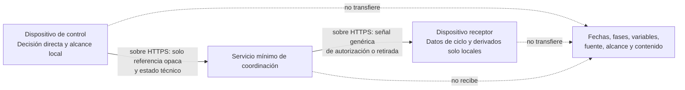
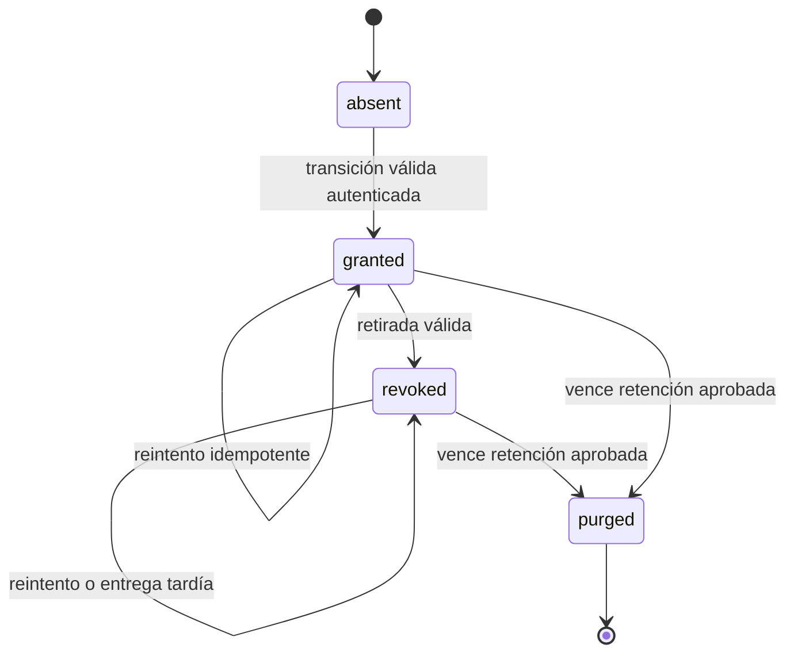
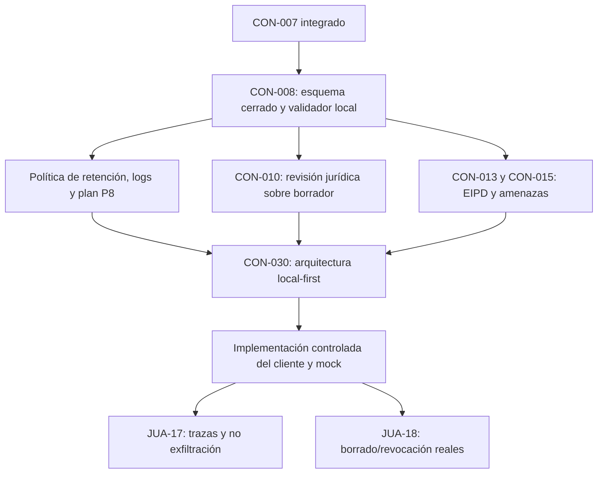

# CON-008 — Requerimientos técnicos y de API para el servicio mínimo de coordinación

**Estado:** análisis técnico de diseño; no constituye una implementación ni autoriza desplegar un servicio.
**Incidencia:** JUA-21 / CON-008.
**Insumos consolidados:** ADR-001, ADR-002, taxonomía P1 y CON-007 integrado en `main`.
**Objetivo:** definir la superficie técnica mínima que permite transportar un estado de consentimiento o una retirada **sin transportar, registrar ni inferir datos de ciclo, variables o contenido derivado**.

> **Conclusión de arquitectura.** CON-008 no debe crear una API de salud, de perfiles ni de sincronización. Debe especificar un relé de estados técnicos opacos y efímeros. Antes de cualquier despliegue, el contrato debe ser cerrado, validable localmente y capaz de rechazar cualquier campo semántico o dato personal.

---

## 0. Decisión registrada — control independiente del consentimiento, no del contenido

**Decisión de producto, 1 de octubre de 2026:** el dato de ciclo, incluida una fecha de sangrado, puede permanecer exclusivamente en el dispositivo receptor de la persona usuaria. La persona afectada tendrá un **dispositivo de control propio** para revisar y retirar el consentimiento, pero no recibirá ni consultará la fecha concreta ni los derivados que el receptor conserve localmente.

Esta decisión conserva la prohibición de transferir o sincronizar datos de ciclo entre dispositivos, pero tiene un límite explícito: la persona afectada no puede auditar, corregir ni confirmar a distancia el contenido concreto del receptor. CON-008 no debe ocultar ese límite ni presentar el dato como clínicamente verificado o procedente de una fuente remota independiente.

| Requisito | Consecuencia de diseño |
|---|---|
| Tarjeta local de consentimiento | El dispositivo de control conserva localmente un resumen legible de qué uso se autoriza, dónde se guardará el dato, límites de inferencia, límite offline, fecha de decisión y referencia opaca asociada. El resumen no viaja al servicio. |
| Retirada independiente | La persona afectada puede retirar un permiso desde su dispositivo. El servicio transporta solo una revocación genérica asociada a referencias opacas; el receptor bloquea y borra conforme a CON-007. |
| Fecha y derivados | La fecha concreta, cálculos, fase e inferencias solo viven en el receptor; no se transmiten al control, al servicio ni a correo electrónico. |
| Entrada de fecha | Una futura interfaz debe requerir una acción local directa de la persona afectada para introducir o confirmar la fecha en el receptor. La aplicación no puede demostrar criptográficamente la identidad de quien toca un dispositivo compartido; por tanto, no puede afirmar que la fecha ha sido verificada. CON-013/015 deben evaluar coerción, suplantación y acceso físico. |
| Sin correo ni enlaces de revisión | No se usan email, cuenta, SMS, URL con token ni enlace de revisión. Procesarían identificadores/contacto o expondrían capacidades en correo, historial, referer, capturas o logs. |
| Cambio de requisito | Si se exige que la persona afectada vea, edite o borre una fecha específica desde su propio dispositivo, será necesario transferir datos de ciclo o habilitar acceso remoto al receptor. Eso contradice ADR-001 y exige una revisión arquitectónica formal antes de modificar CON-008. |

> Esta es una decisión de control sobre el permiso, no una garantía de veracidad del contenido local. La interfaz debe explicarlo sin ambigüedad y no puede convertir la autorización en una declaración de que los datos son exactos.

---

## 1. Base técnica actual y consecuencia de diseño

| Hallazgo comprobado | Consecuencia para CON-008 |
|---|---|
| El cliente vigente es React + Vite y PWA; no hay backend de producto. | La primera entrega es documentación, esquema y validador local. No se añade una API operativa en esta tarea. |
| La superficie actual de código no contiene `fetch`, WebSocket, `sendBeacon`, SDK de analítica ni almacenamiento funcional de datos de ciclo. | La única futura llamada de red debe concentrarse en un adaptador de coordinación explícito y auditable; toda otra llamada se considera fallo. |
| La PWA genera un Service Worker con precaché de recursos estáticos. | El origen de coordinación y sus respuestas deben quedar fuera de caché, Background Sync y colas del Service Worker. |
| El producto prohíbe CDN, recursos externos, analítica, telemetría y reportes remotos de error. | El servicio no puede introducir SDK de observabilidad, WAF con registros incompatibles, proxy de analítica, píxeles, fuentes o dependencias remotas en ejecución. |
| CON-007 define que el alcance `categoría × fuente` existe solo localmente. | El API remoto debe rechazar `scope`, categoría, fuente, fase, fecha, variable y cualquier codificación reversible de ellos. |

La presencia transitiva de paquetes de desarrollo no equivale a una llamada en ejecución, pero antes de desplegar deberá verificarse que la configuración PWA no incorpora analítica de Workbox ni caché de respuestas de coordinación.

## 2. Límites no negociables

### 2.1. Lo que el servicio puede procesar

La excepción de ADR-001 permite exclusivamente metadatos técnicos de coordinación:

1. **Referencia de vínculo técnico opaca** entre un control y un receptor.
2. **Referencia de consentimiento opaca**, efímera o rotable, sin significado clínico.
3. **Estado técnico cerrado** de ese consentimiento: creación/autorización, retirada o invalidación.
4. **Solicitud genérica de revocación** dirigida al receptor mediante referencias opacas.
5. **Metadatos operativos generados por el servidor** imprescindibles para expiración, deduplicación y purga, siempre con retención limitada.
6. **Prueba criptográfica o de posesión** necesaria para impedir que un tercero escriba o lea un vínculo; el mecanismo concreto queda condicionado por CON-015.

### 2.2. Lo que el servicio debe rechazar de forma estricta

| Clase prohibida | Ejemplos a rechazar |
|---|---|
| Ciclo y salud | `date`, `bleeding`, `duration`, `phase`, `window`, `symptom`, `intensity`, `contraception`, `inference`, `diagnosis`. |
| Semántica local de consentimiento | `scope`, `category`, `source`, `self_report`, `partner_observation`, finalidad de aprendizaje o explicación. |
| Identidad y contacto | `name`, `email`, `phone`, `account_id`, `user_id`, `contact`, `location`, identificadores publicitarios o fingerprint. |
| Contenido libre | `note`, `message`, `reason`, `comment`, pantalla, adjunto, texto de error de cliente. |
| Vigilancia y producto comercial | `analytics`, `telemetry`, `event`, `session_replay`, `metric`, `experiment`, `pixel`, `crash_report`. |
| Extensibilidad implícita | Cualquier propiedad no definida por el esquema v1, incluidas propiedades anidadas y parámetros de consulta. |

> Una referencia opaca no debe contener un prefijo, hash, cifrado reversible, concatenación o codificación del alcance local. `local_scope:physical_bloating:self_report:v1` puede existir únicamente en fixtures y almacenamiento local; nunca debe aparecer en una carga, ruta, encabezado, error o log remoto.

## 3. Frontera de componentes



| Componente | Responsabilidad permitida | Prohibición principal |
|---|---|---|
| Dispositivo de control | Presentar explicación, mostrar la tarjeta local de consentimiento, registrar la decisión directa y conservar el mapa local `alcance → referencia opaca`. | No recibir fecha, fase, derivado ni contenido del receptor; no enviar alcance, categoría, fuente ni razón de retirada. |
| Servicio mínimo | Conservar de forma limitada referencias opacas, estado técnico y señal genérica de retirada. | No crear perfiles, cuentas de ciclo, historial de salud, confirmaciones de lectura ni contenido sensible. |
| Dispositivo receptor | Mantener los datos locales, habilitar una entrada directa futura, comprobar una señal recibida, bloquear y borrar según CON-007. | No sincronizar datos locales ni confirmar al control qué datos borró o cómo está la persona. |

## 4. Modelo remoto mínimo de datos

La tabla describe el **máximo** remoto. Todos los valores son técnicos, no clínicos.

| Campo remoto | Uso | Reglas obligatorias |
|---|---|---|
| `protocol_version` | Seleccionar un esquema cerrado. | Valor único `consona-coordination/v1`; ninguna negociación libre de versión. |
| `routing_ref` | Dirigir una señal a un receptor vinculado. | 256 bits CSPRNG, Base64url sin prefijos semánticos, rotable y con expiración. Nunca en URL, query, cookie ni log. |
| `consent_ref` | Identificar una época técnica de consentimiento sin revelar el alcance local. | 256 bits CSPRNG, independiente de `routing_ref`; uno nuevo tras una retirada o nueva autorización; no reutilizable. |
| `state` | Expresar solo el estado permitido. | Enum cerrado: `granted` o `revoked`. Una vez `revoked`, ese `consent_ref` nunca vuelve a `granted`. |
| `event_ref` | Deduplicar una transición o reintento. | 128 bits CSPRNG, TTL corto, no expresa orden, persona ni dispositivo. |
| `proof` | Verificar que quien escribe/lee posee la capacidad autorizada. | Blob opaco de tamaño limitado; algoritmo, bootstrap y rotación condicionados a CON-015. Nunca usar cookies, cuenta, correo o fingerprint. |
| `created_at`, `expires_at`, `purge_at` | Aplicar retención y purga. | Generados por el servidor, no enviados por cliente, no expuestos como historial y retenidos solo el tiempo aprobado. |

### 4.1. Modelo de estado remoto

El servicio guarda únicamente el último estado técnico por `consent_ref` y no conoce a qué alcance local corresponde.



Reglas:

- **Revocación terminal:** el mismo `consent_ref` no puede reactivarse.
- **Nuevo consentimiento, nueva referencia:** una autorización nueva crea un `consent_ref` distinto y no restaura estado ni datos locales previos.
- **Sin historia expuesta:** el servicio no ofrece lista de transiciones, enlaces, usuarios, dispositivos ni confirmaciones de lectura.
- **Sin orden semántico:** `event_ref` evita duplicados; la regla terminal de `revoked` evita que una autorización antigua reactive el estado.

## 5. Superficie API lógica mínima

La superficie debe limitarse a una única ruta fija de coordinación, por ejemplo `POST /v1/coordination`, sin identificadores en la URL, sin parámetros de consulta y sin endpoints de listado, búsqueda, perfil, exportación o diagnóstico.

> La ruta, los nombres de campo y los ejemplos son un contrato de diseño. No se debe publicar, desplegar ni conectar al cliente hasta que superen CON-010, CON-013, CON-015 y CON-030.

### 5.1. Operaciones permitidas

| Operación lógica | Quién la solicita | Efecto remoto permitido | Restricciones |
|---|---|---|---|
| `bootstrap` | Control o receptor, tras vínculo seguro. | Establece una referencia de vínculo técnico opaca. | El protocolo de emparejamiento y la prueba de posesión siguen bloqueados por CON-015; no se implementa todavía. |
| `transition` | Control autorizado. | Crea `granted` o cambia a `revoked` un `consent_ref` opaco. | No acepta alcance, categoría, fuente, razón, datos de salud ni historial. `revoked` es terminal. |
| `retrieve` | Receptor, solo en una acción explícita de primer plano. | Devuelve señales genéricas pendientes o el estado técnico mínimo de referencias ya conocidas localmente. | Sin polling, WebSocket, SSE, push, webhooks, Background Sync ni confirmación de lectura para el control. |

La recuperación al abrir o reanudar explícitamente la app puede ser necesaria para recibir una retirada; no equivale a comprobar periódicamente el estado. Si el receptor está offline, el producto solo puede comunicar que la retirada se aplicará cuando la reciba.

### 5.2. Envelope de solicitud propuesto

```json
{
  "protocol_version": "consona-coordination/v1",
  "kind": "transition",
  "routing_ref": "base64url-256-bit-random-value",
  "consent_ref": "base64url-256-bit-random-value",
  "state": "revoked",
  "event_ref": "base64url-128-bit-random-value",
  "proof": "opaque-bounded-proof"
}
```

Para `retrieve`, solo se permiten `protocol_version`, `kind`, `routing_ref`, `proof` y un `event_ref` de deduplicación. Una respuesta de recuperación contiene exclusivamente referencias opacas y `state`; nunca devuelve una categoría, una fuente, una fecha, un motivo, un historial o una confirmación del borrado local.

### 5.3. Reglas HTTP y de respuesta

| Requisito | Decisión técnica |
|---|---|
| Transporte | HTTPS obligatorio; TLS actual, HSTS y sin contenido mixto. |
| Método y URL | Solo `POST` a una ruta fija. Prohibir GET con referencias, URLs con tokens, query strings y callbacks. Así se evita que referencias queden en logs de rutas, historial o referers. |
| Cuerpo | `application/json`, tamaño máximo estricto y esquema con `additionalProperties: false`. |
| CORS | Lista exacta de orígenes de la app estática aprobada; nunca `*`, nunca credenciales y nunca cookies. |
| Cookies | No emitir ni aceptar `Set-Cookie`; cliente usa `credentials: "omit"`. |
| Respuestas | `Cache-Control: no-store, no-transform`, `Pragma: no-cache`, `X-Content-Type-Options: nosniff`; no incluir valores rechazados en el error. |
| Errores | Códigos genéricos y no enumerables: `invalid_request`, `not_available`, `temporarily_unavailable`. No distinguir públicamente enlace inexistente, expirado o no autorizado. |
| Entrega | La aceptación por el servicio no es confirmación de recepción ni de borrado local; no exponer recibos al dispositivo de control. |
| Concurrencia | `revoked` domina sobre `granted`; la operación debe ser atómica por `consent_ref`. |

### 5.4. Operaciones expresamente excluidas

- cuentas, inicio de sesión, perfiles, recuperación de contraseña o identidad convencional;
- API de calendario, fases, variables, inferencias, contenido, clínica o mensajería;
- listado de vínculos, búsquedas, exportación, historial, analítica, auditoría de uso o confirmaciones de lectura;
- WebSocket, Server-Sent Events, webhooks, notificaciones push, Background Sync y polling periódico;
- envío de correos, SMS, contactos, ubicación, CAPTCHA de terceros o cualquier SDK externo;
- APIs de soporte, reporte remoto de errores o trazas que reciban payloads/encabezados de coordinación.

## 6. Emparejamiento, prueba de posesión y límites pendientes

CON-008 puede fijar el **contrato de datos**, pero no puede declarar seguro el emparejamiento. C7 y CON-015 deben decidir y probar:

- cómo se inicia un vínculo sin cuenta, nombre, correo, teléfono ni fingerprint;
- cómo cada dispositivo demuestra posesión de una capacidad sin exponerla en URL, logs o capturas;
- cómo se rota o invalida una referencia tras pérdida, reenvío, sospecha de coerción o dispositivo comprometido;
- cómo se evita que una persona empareje un dispositivo sin la decisión directa de la persona afectada;
- qué información de red o proveedor podría funcionar como identificador y cómo se minimiza;
- qué hacer ante repetición, secuestro, fuerza bruta, enumeración o entrega fuera de orden.

**Requisito de diseño para CON-008:** el campo `proof` y el flujo `bootstrap` solo pueden ser placeholders tipados, sin implementación de producción, hasta disponer del modelo de amenazas. Una referencia opaca por sí sola **no es autenticación**.

## 7. Retención, purga, logs y operación

### 7.1. Retención que debe decidirse antes de desplegar

| Dato técnico | Regla | Decisión que falta |
|---|---|---|
| Vínculo `routing_ref` | Debe expirar, rotar y poder invalidarse. | TTL máximo, disparadores de rotación y política de pérdida de dispositivo. |
| Estado `granted` | Solo mientras sea necesario para dirigir la coordinación permitida. | Retención aprobada y comportamiento al vencer. |
| Estado `revoked` | Debe persistir lo suficiente para que un receptor offline pueda recibirlo. | Ventana máxima validada por EIPD, legal y amenazas; no puede ser ilimitada. |
| `event_ref` | Solo para deduplicación/reintentos. | TTL corto concreto y purga automática. |
| Claves/pruebas técnicas | Rotables y revocables; sin backups de secreto. | Algoritmo, almacenamiento local y revocación bajo CON-015/CON-030. |

No se fija ningún número de días en CON-008. Un valor arbitrario podría elevar riesgo o impedir una retirada efectiva. No habrá despliegue mientras EIPD, revisión jurídica y modelo de amenazas no aprueben una política cuantificada.

### 7.2. Política de logs

- No registrar cuerpos, encabezados, IP completas, `routing_ref`, `consent_ref`, `event_ref`, `proof`, URL de referencia ni respuestas del API.
- Desactivar logs de acceso del proxy, CDN, plataforma, WAF y aplicación que permitan vincular solicitudes a una referencia o dirección IP más allá del mínimo inevitable de transporte.
- Prohibir servicios de analytics, APM, sesión, crash reporting, replay, debugging remoto, exportación de logs y captura automática de excepciones.
- Los errores de cliente deben ser locales y genéricos; nunca se envían al servicio.
- Si el proveedor no permite configurar retención, región, supresión o minimización de logs de forma compatible, ese proveedor queda descartado.

La dirección IP y otros metadatos de red pueden ser datos personales aunque no aparezcan en el JSON. CON-010 debe revisar roles, base jurídica, proveedor, región, subprocesadores y retención antes de cualquier producción.

## 8. Integración del cliente estático y la PWA

La futura app debe adoptar una frontera de red única:

```text
src/coordination/coordinationClient.js
        └── única ubicación autorizada para fetch hacia el origen de coordinación
```

Requisitos:

1. No usar `fetch` fuera de ese módulo sin una revisión explícita de seguridad.
2. El origen permitido se configura por entorno de despliegue, no se construye desde entrada de usuario, parámetros, contenido remoto ni `localStorage`.
3. En fase de desarrollo y pruebas, el cliente usa un mock local en memoria; no un endpoint externo.
4. La llamada usa `credentials: "omit"`, `cache: "no-store"`, método POST y un cuerpo validado antes de enviarse.
5. El Service Worker no debe hacer `runtimeCaching` ni Background Sync para el origen de coordinación. Las respuestas API llevan `Cache-Control: no-store` y no entran en precaché.
6. Si el control está sin red, una retirada pendiente se conserva solo localmente bajo la política de almacenamiento futura; se reintenta al abrir/reanudar por acción explícita, no en segundo plano ni mediante sondeo.
7. La CSP del cliente debe usar `default-src 'self'`; `connect-src` solo podrá incluir `'self'` y el origen de coordinación exacto aprobado. No puede admitir comodines, proveedores de analítica ni otros subdominios.
8. El bundle, manifest, Service Worker y dependencias se inspeccionan antes de cada entrega para confirmar ausencia de recursos externos.
9. El dispositivo de control mantiene la tarjeta de consentimiento y el mapa local de referencias; no solicita, renderiza ni almacena la fecha concreta, fase, cálculo o derivado del receptor.
10. La interfaz del receptor separa la entrada directa futura de la pantalla de quien consulta. Antes de que CON-013/015 definan controles de acceso físico, la aplicación no puede afirmar que una fecha local fue introducida o verificada por una identidad concreta.

## 9. Evidencia, validación y pruebas necesarias

### 9.1. Entregables de la primera implementación documental/local

| Entregable | Evidencia exigida |
|---|---|
| Esquema `consona-coordination-v1` | JSON Schema cerrado, enumeraciones, límites de tamaño y `additionalProperties: false`. |
| Esquema local de tarjeta de consentimiento | Modelo local, sin red, que conserva resumen legible, alcance local, referencia opaca, decisión y retiro; excluye fecha, fase, variables y derivados. |
| Fixtures válidos | `transition` de `granted` y `revoked`, recuperación de referencia opaca, sin datos reales. |
| Fixtures inválidos | `scope`, categoría, fuente, fecha, fase, síntomas, identidad, texto libre, analytics, propiedad extra, URL/token y codificación semántica. |
| Validador local | Se ejecuta sin red ni almacenamiento de usuario; acepta válidos y rechaza inválidos con mensajes no sensibles. |
| Política de retención/logs | Documento con campos, datos prohibidos, TTL por decidir y requisitos de purga/configuración de proveedor. |
| Plan P8/JUA-17 | Inventario de endpoints, CSP, dependencias, caché, logs y trazas sintéticas que deberá auditarse sobre flujos reales. |
| Mapa CON-007 → CON-008 | Pruebas A-05, A-07, O-05 y S-01 mapeadas al esquema y al validador. |

### 9.2. Pruebas de rechazo mínimas

| ID | Intento | Resultado obligatorio |
|---|---|---|
| C8-01 | Añadir `scope`, `category` o `source`. | Rechazo de esquema, sin eco del valor. |
| C8-02 | Añadir una fecha, fase, intensidad, variable o inferencia. | Rechazo de esquema, sin persistencia ni log. |
| C8-03 | Añadir nombre, correo, teléfono, cuenta, IP suministrada por cliente o texto libre. | Rechazo de esquema. |
| C8-04 | Enviar una referencia con prefijo semántico, UUID de cuenta o valor de longitud inválida. | Rechazo de formato; no intentar normalizarla. |
| C8-05 | Repetir un evento con el mismo `event_ref`. | Resultado idempotente, sin nuevo estado ni historial expuesto. |
| C8-06 | Enviar `granted` tras `revoked` con el mismo `consent_ref`. | Rechazo o estado final `revoked`; nunca reactivación. |
| C8-07 | Intentar obtener listas, estados de otros vínculos, confirmación de lectura o exportación. | No existe endpoint ni respuesta equivalente. |
| C8-08 | Intentar recibir con query string, GET, cookie o credenciales. | Rechazo de método/configuración; sin cache y sin cookie. |
| C8-09 | Inspeccionar PWA, CSP y red en mock. | Solo recursos locales y, cuando exista, el origen único de coordinación; sin runtime caching del API. |
| C8-10 | Intentar incluir fecha, fase, variables o derivados en la tarjeta de consentimiento o en la retirada del dispositivo de control. | Rechazo local y remoto; el control solo muestra el resumen de permiso, nunca contenido del receptor. |

## 10. Dependencias y puertas de decisión

| Trabajo | Estado / relación con CON-008 | Qué permite o bloquea |
|---|---|---|
| JUA-10 / P1 | Completado. | Aporta límites del vocabulario local; no concede transporte remoto. |
| JUA-20 / CON-007 | Completado e integrado en `main`. | Aporta máquina de estados, retirada/offline y la regla de referencia opaca. |
| JUA-21 / CON-008 | En progreso. | Debe cerrar C1, C2 y el diseño previo de C6; bloquea JUA-17 y el cierre de JUA-13. |
| JUA-17 / P8 | Formalmente bloqueada por JUA-21. | Solo podrá probar no exfiltración sobre flujos reales cuando existan arquitectura y cliente controlado. |
| JUA-22 / CON-010 | Puede avanzar en paralelo con borradores. | Su conclusión debe revisar el contrato consolidado, proveedor, región, roles, retención y transparencias. |
| CON-013 / EIPD y violencia tecnológica | No aparece como incidencia hija separada en Linear. | Debe decidir riesgo residual, ventana offline y si ciertas capacidades pueden vetarse. |
| CON-015 / amenazas y revocación | No aparece como incidencia hija separada en Linear. | Bloquea la selección final de bootstrap, prueba de posesión, anti-replay y defensa contra coerción/suplantación. |
| CON-030 / arquitectura local-first | No aparece como incidencia hija separada en Linear. | Bloquea proveedor, región, infraestructura, CSP final y despliegue. |

### Secuencia de trabajo propuesta



## 11. Decisiones pendientes que bloquean producción, no el contrato documental

1. **Mecanismo de emparejamiento y prueba de posesión:** requiere CON-015; no se debe elegir una solución de QR, clave pública, código de un solo uso o token portador sin modelo de amenazas.
2. **Ventana offline y retención de retirada:** requiere CON-013, CON-010 y CON-015; no establecer una caducidad arbitraria.
3. **Proveedor, región europea, subprocesadores y logs de infraestructura:** requiere CON-010 y CON-030.
4. **Almacenamiento local de claves, referencias y retirada pendiente:** requiere arquitectura local-first y evidencia de borrado posterior.
5. **Origen de producción y CSP final:** requiere decisión de hosting y revisión de distribución estática.
6. **Observación de pareja:** sigue fuera de la v1 de taxonomía; CON-008 no debe abrir una fuente remota para ella.

## 12. Recomendación operativa inmediata

El siguiente entregable de JUA-21 debe ser un paquete **sin red de producción**:

1. `docs/security/consona-coordination-v1.schema.json`;
2. fixtures `valid/` e `invalid/` del contrato de coordinación;
3. un script local `validate-coordination-fixtures.mjs` integrado en `npm run validate:coordination`;
4. política versionada de retención, purga, logs y errores;
5. esquema y fixtures locales de la tarjeta de consentimiento, incluida la prueba C8-10;
6. plan de evidencia para JUA-17 y trazabilidad a A-05, A-07, O-05 y S-01 de CON-007.

Ese paquete permite demostrar C1 y avanzar C2/C6 sin construir un servidor ni usar datos personales. Un servicio real, un proveedor, una ruta de red del cliente o un piloto siguen bloqueados por las puertas indicadas.

## Referencias

- ADR-001, §§ 2–5: excepción remota mínima, C1–C10 y límite offline.
- ADR-002, §§ 3–7: datos locales, consentimiento granular, P2/P5/P8 y límites de intimidad.
- CON-007: protocolo y matriz de pruebas integrados en `docs/security/`.
- JUA-17, JUA-21, JUA-22 y JUA-13 en Linear.
